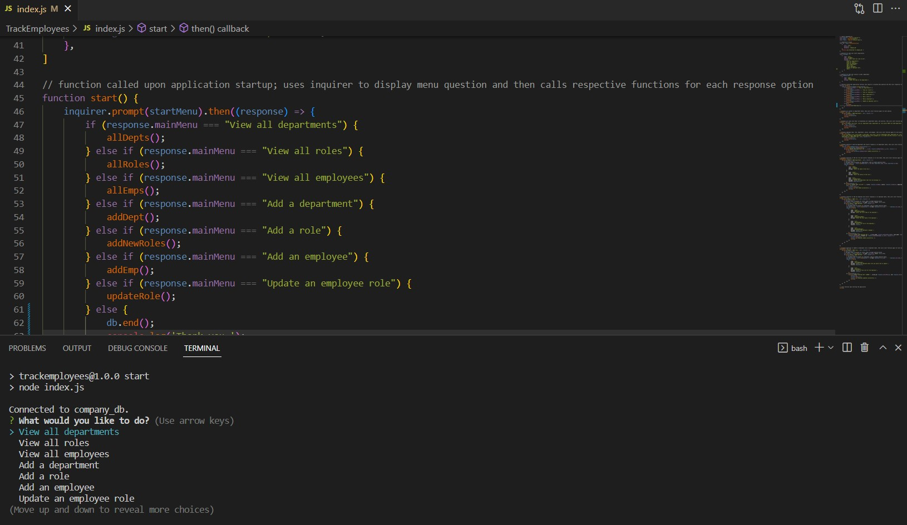

# Track Employees - SQL
 
## Description
 
This project is run in the command line using inquirer, console.table, and mysql2. It allows the user to add to and update tables in a mysql database that hold information about a company and it's employees. This information includes the company's departments, the employee's personal information, etc. This system is extremely useful for keeping track of employees as they join the company, leave the company, or are promoted. It can also keep track of the different departments in the company, the base salary for different job roles, and much more. It solves the problem of using cumbersome spreadsheets or pen and paper to keep track of your company's information.
 
 
## Usage
 
To use this project, you will need to do the following:

1) Download all the necessary files and dependencies
2) Run the command 'npm start' in the terminal
3) Select the options you desire and fill out any prompts you are given with the appropriate information
4) When you are done, select the 'exit' option to end the program
 
 
## Link to Video Demonstration
 
[Title Here](https://autumnlegere.github.io/ repo name here)
 
 
## Screenshot
 
This is a screenshot of the project.

 
 
## Credits
 
- Code for foreign key syntax  
    - [www.w3schools.com](https://www.w3schools.com/sql/sql_foreignkey.asp)
- Code for queries, mysql syntax in index.js, linking responses to database tables, mapping table information and inserting it into inquirer prompts, db.end(), and using console.table properly  
    - [github.com/samrogers15](https://github.com/samrogers15/MySQL-employee-tracker/blob/main/server.js)
- Code for decimal data type in table  
    - [www.mysqltutorial.org](https://www.mysqltutorial.org/mysql-decimal/#:~:text=MySQL%20uses%20binary%20format%20to,9%20digits%20into%204%20bytes.&text=For%20example%2C%20DECIMAL(19%2C,fractional%20part%20requires%204%20bytes)
